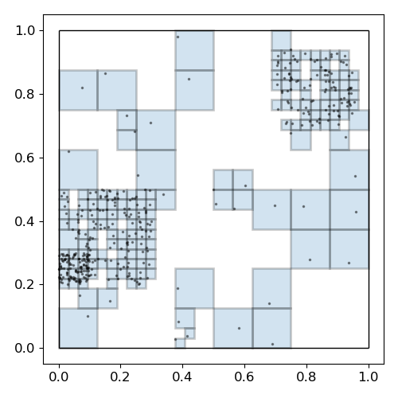

SparseBins is a python class intended to efficiently bin 
high dimensional non-uniformly distributed data for the purpose of associating scalar volumes to clustered or sparse nonuniformly distributed data.
Such volumes are useful for estimating integrals over fractions of a domain when the entire domain is not completely covered by sufficient or uniformly distributed data.
 
Given specifications for maximum and minimum bin widths, and a collection of dimensionally arbitrary data scaled to fit within a unit (hyper)cube, the class constructor will recursively subdivide occupied bins, while discarding empty bins, until the bin either has only one element while satisfying the maximum bin width, or until the bin reaches the minimum width while containing multiple elements.
 
A 2-D example is given below using minBinWidth=2^-5 and maxBinWidth=2^-3:

